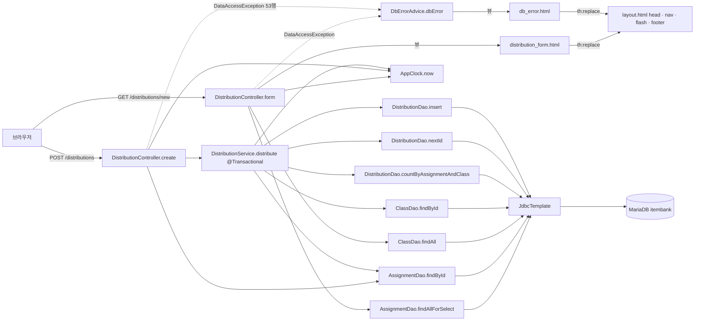

# assignment-thymeleaf 아키텍처 — "새 배포" 화면

대상: `legacy/assignment-thymeleaf`. 근거는 `파일:줄번호` 로 적는다. 경로 앞의 `legacy/assignment-thymeleaf/src/main/` 은 생략하고, `java/…` · `resources/…` 부터 적는다. 모듈 밖 파일은 전체 경로로 적는다.

**분석 범위(제한)**: "새 배포" 화면 하나와 그 화면이 호출하는 코드만 분석했다.
- 포함: `GET /distributions/new`(폼 표시), `POST /distributions`(폼 제출), 이 둘이 호출하는 서비스 · DAO · 모델 · 템플릿 · 설정 · 전역 예외 처리.
- 제외(분석하지 않음): `GET /distributions`(배포 목록), `POST /distributions/{id}/redistribute`(재배포, `DistributionService.redistribute` `java/com/example/assign/service/DistributionService.java:70-701`), `GET /assignments`(`AssignmentController`, `assignments.html`), `distributions.html`, 모델 `DistributionRow` · `RedistributeResult` · `SubmissionRow`, DAO 메서드 `findAllForList` · `findById`(DistributionDao) · `markRedistributed` · `findSubmissions`.

## 1. 모듈 개요

- Spring Boot 3.3.4 · Java 17 · Thymeleaf · `spring-boot-starter-jdbc`(JdbcTemplate) 앱이다(`legacy/assignment-thymeleaf/build.gradle:3`, `build.gradle:11-12`, `build.gradle:25-27`). JPA 없이 DAO 가 SQL 문자열을 직접 실행한다.
- 과제 배포 관리 v1.4.2(`build.gradle:8`, `resources/templates/layout.html:35`). compose 서비스 `assignment`(profile `thymeleaf`)로 띄우고 호스트 포트는 8082 다(`docker-compose.yml:50-54`).
- DB 는 문항 은행과 같은 MariaDB `itembank` 를 쓴다(`resources/application.properties:2`, `db/mariadb/init/01-schema.sql:73`).
- **현재 시각은 고정값이다.** `AppClock.now()` 는 시스템 속성 `app.clock=system` 이 없으면 `2026-09-15 00:00:00` 을 돌려준다(`java/com/example/assign/AppClock.java:9`, `AppClock.java:14-20`). Dockerfile · compose 어디에도 `app.clock` 설정이 없으므로(`legacy/assignment-thymeleaf/Dockerfile:11`) 컨테이너에서도 고정 시각으로 동작한다. 새 배포 화면의 마감 판정 · 배포 일시가 모두 이 값을 쓴다.
- 이 화면 범위의 코드: 컨트롤러 1개 중 메서드 2개, 서비스 메서드 1개(`distribute`, 22줄), DAO 3개 중 메서드 7개, 템플릿 3개(`distribution_form.html`, `layout.html`, `db_error.html`).

## 2. 폴더 구조

범위에 드는 파일만 표시한다(`*` = 파일 일부만 범위).

```
legacy/assignment-thymeleaf/
├── build.gradle                 의존성 · Java 17 · bootJar 이름 assignment.jar
├── Dockerfile                   gradle bootJar → temurin 17 JRE 로 실행
└── src/main/
    ├── java/com/example/assign/
    │   ├── AssignApplication.java        @SpringBootApplication 메인
    │   ├── AppClock.java                 고정 시각(2026-09-15 00:00:00) · 날짜 포맷
    │   ├── web/
    │   │   ├── DistributionController.java *  form · create (list · redistribute 제외)
    │   │   └── DbErrorAdvice.java            DataAccessException → db_error 화면
    │   ├── service/
    │   │   └── DistributionService.java  *  distribute (47-68행)
    │   ├── dao/
    │   │   ├── AssignmentDao.java        *  findAllForSelect · findById
    │   │   ├── ClassDao.java                findAll · findById
    │   │   └── DistributionDao.java      *  countByAssignmentAndClass · nextId · insert
    │   └── model/
    │       ├── AssignmentRow.java           과제 행(id, title, unit, dueAt, status, classCount)
    │       └── ClassRow.java                학급 행(id, name, teacherId)
    └── resources/
        ├── application.properties       포트 8080 · MariaDB 접속 · Hikari
        └── templates/
            ├── distribution_form.html   새 배포 폼
            ├── layout.html              head · nav · flash · footer 프래그먼트
            └── db_error.html            DB 오류 화면
```

## 3. 진입점

| 구분 | 진입점 | URL / 실행 | 처리 | 결과 |
|---|---|---|---|---|
| 메인 클래스 | `AssignApplication.main` (`java/com/example/assign/AssignApplication.java:9-11`) | `java -Dfile.encoding=UTF-8 -jar /app/assignment.jar` (`Dockerfile:11`) | Spring Boot 기동, 포트 8080 (`resources/application.properties:1`) | 호스트 8082 로 노출 (`docker-compose.yml:53-54`) |
| 화면(GET) | `DistributionController.form` (`java/com/example/assign/web/DistributionController.java:40-47`) | `GET /distributions/new` | 과제 선택 목록 · 학급 목록 · 현재 시각 · 메뉴를 모델에 담음 | 뷰 `distribution_form` (`resources/templates/distribution_form.html`) |
| 폼 제출(POST) | `DistributionController.create` (`DistributionController.java:49-77`) | `POST /distributions` (파라미터 `assignmentId`, `classId`) | 과제 존재 · 마감 검사 → `DistributionService.distribute` | 성공: `redirect:/distributions` + flash `message` / 실패: `redirect:/distributions/new` + flash `error` |
| 전역 예외 | `DbErrorAdvice.dbError` (`java/com/example/assign/web/DbErrorAdvice.java:11-17`) | 컨트롤러에서 잡히지 않은 `DataAccessException` | 콘솔 출력 · 상세 메시지를 모델에 담음 | 뷰 `db_error` (`resources/templates/db_error.html`) |

- 폼 화면 진입 경로: 상단 메뉴 "새 배포" 링크(`resources/templates/layout.html:26`), 그리고 POST 실패 시의 `redirect:/distributions/new`(`DistributionController.java:56`, `:63`, `:71`, `:74`)다.
- 폼은 `th:action="@{/distributions}"` 로 POST 한다(`resources/templates/distribution_form.html:8`). 두 `select` 에는 `required` 가 있다(`distribution_form.html:11`, `distribution_form.html:23`).
- 컨트롤러 파라미터는 `@RequestParam("assignmentId") long`, `@RequestParam("classId") long` 이다(`DistributionController.java:50-51`). 필수 파라미터이며 원시 타입 `long` 이다.

## 4. 의존 관계

방향은 모두 **호출하는 쪽 → 호출되는 쪽**이다. 근거 줄은 호출하는 쪽 파일의 줄이다.

### 4.1 흐름도



### 4.2 호출 표

| 호출하는 쪽 | 호출되는 쪽 | 근거 |
|---|---|---|
| `DistributionController` 생성자 | `DistributionService`, `AssignmentDao`, `ClassDao` 주입 | `java/com/example/assign/web/DistributionController.java:26-30` |
| `DistributionController.form` | `AssignmentDao.findAllForSelect()` | `DistributionController.java:42` |
| `DistributionController.form` | `ClassDao.findAll()` | `DistributionController.java:43` |
| `DistributionController.form` | `AppClock.now()` | `DistributionController.java:44` |
| `DistributionController.form` | 뷰 `distribution_form` | `DistributionController.java:46` |
| `DistributionController.create` | `AssignmentDao.findById(assignmentId)` | `DistributionController.java:53` |
| `DistributionController.create` | `AppClock.now()`, `AppClock.fmt(..)` | `DistributionController.java:58`, `:62` |
| `DistributionController.create` | `DistributionService.distribute(assignmentId, classId)` | `DistributionController.java:67` |
| `DistributionService.distribute` | `AssignmentDao.findById(assignmentId)` | `java/com/example/assign/service/DistributionService.java:48` |
| `DistributionService.distribute` | `ClassDao.findById(classId)` | `DistributionService.java:52` |
| `DistributionService.distribute` | `DistributionDao.countByAssignmentAndClass(..)` | `DistributionService.java:59` |
| `DistributionService.distribute` | `DistributionDao.nextId()` | `DistributionService.java:62` |
| `DistributionService.distribute` | `DistributionDao.insert(id, .., AppClock.now())` | `DistributionService.java:63` |
| `AssignmentDao` · `ClassDao` · `DistributionDao` | `JdbcTemplate` 생성자 주입 | `java/com/example/assign/dao/AssignmentDao.java:17-19`, `dao/ClassDao.java:16-18`, `dao/DistributionDao.java:19-21` |
| `distribution_form.html` | `layout :: head('새 배포')`, `nav(${menu})`, `flash`, `footer` | `resources/templates/distribution_form.html:3`, `:5`, `:7`, `:32` |
| `db_error.html` | `layout :: head('오류')`, `nav(${menu})`, `footer` | `resources/templates/db_error.html:3`, `:5`, `:9` |
| Spring MVC | `DbErrorAdvice.dbError` (`@ExceptionHandler(DataAccessException.class)`) | `java/com/example/assign/web/DbErrorAdvice.java:8-12` |
| `DbErrorAdvice.dbError` | `System.out.println`, 뷰 `db_error` | `DbErrorAdvice.java:13`, `:16` |

### 4.3 외부 설정 · DB 접속

| 호출하는 쪽 | 호출되는 쪽 | 근거 |
|---|---|---|
| Spring Boot 자동 설정(`spring-boot-starter-jdbc`) | `DataSource`(Hikari) · `JdbcTemplate` 빈 생성 | `legacy/assignment-thymeleaf/build.gradle:27` |
| `application.properties` | `jdbc:mariadb://localhost:3306/itembank`, 계정 `app`/`app-pass` (환경변수 `SPRING_DATASOURCE_*` 가 있으면 그 값) | `resources/application.properties:2-4` |
| `application.properties` | Hikari `maximum-pool-size=4`, `connection-timeout=5000`, `initialization-fail-timeout=-1` | `application.properties:6-8` |
| compose `assignment` 서비스 | `SPRING_DATASOURCE_URL=jdbc:mariadb://mariadb:3306/itembank`, 계정 `app` | `docker-compose.yml:61-63` |
| MariaDB 드라이버 | `org.mariadb.jdbc:mariadb-java-client` (runtimeOnly) | `build.gradle:28`, `application.properties:5` |

### 4.4 의존 관계에서 주의할 점

- **컨트롤러가 DAO 를 직접 호출한다.** 폼 목록(`DistributionController.java:42-43`)과 POST 의 과제 조회(`:53`)가 서비스를 거치지 않는다. `modern/api` 규칙(컨트롤러 → 서비스 → 리포지토리)으로 옮길 때 서비스로 모아야 한다.
- **과제를 두 번 조회한다.** POST 한 번에 `AssignmentDao.findById` 가 컨트롤러(`DistributionController.java:53`)와 서비스(`DistributionService.java:48`)에서 각각 실행된다. 존재 검사도 양쪽에 있다(`DistributionController.java:54-57`, `DistributionService.java:49-51`).
- **검증이 두 계층에 나뉘어 있다.** 마감 검사는 컨트롤러에만 있고(`DistributionController.java:60-65`), 학급 존재 · 삭제 상태 · 중복 검사는 서비스에만 있다(`DistributionService.java:52-61`). 서비스만 호출하면 마감 검사를 건너뛴다.
- **DB 예외 처리 경로가 둘이다.** `distribute` 안의 `DataAccessException` 은 컨트롤러가 잡아 flash 오류로 바꾼다(`DistributionController.java:72-74`). `try` 밖인 53행 조회와 GET 폼의 조회에서 난 `DataAccessException` 은 `DbErrorAdvice` 가 `db_error` 화면으로 바꾼다(`DbErrorAdvice.java:11-16`).
- **환경변수 `DB_HOST` · `DB_PORT` · `DB_NAME` · `DB_USER` · `DB_PASS` 는 이 모듈이 읽지 않는다.** compose 가 설정하지만(`docker-compose.yml:56-60`) 모듈 `src` · `build.gradle` · `Dockerfile` 에서 참조하는 곳이 없다(Grep 결과 0건). 실제 접속은 `SPRING_DATASOURCE_*` 로 정해진다.
- `@Transactional` 은 `distribute` 에 붙어 있고(`DistributionService.java:46`), 트랜잭션 안에서 `countBy…` → `nextId` → `insert` 가 차례로 실행된다(`DistributionService.java:59-63`). 트랜잭션 격리 수준 설정은 없다(Grep 결과 `@Transactional` 2건, 속성 없음). 동시 요청에서 생기는 문제는 `BUSINESS-RULES.md` 에서 다룬다.
- `AppClock` 은 정적 메서드라 주입 없이 컨트롤러 · 서비스에서 바로 호출한다(`DistributionController.java:44`, `:58`, `DistributionService.java:63`).
