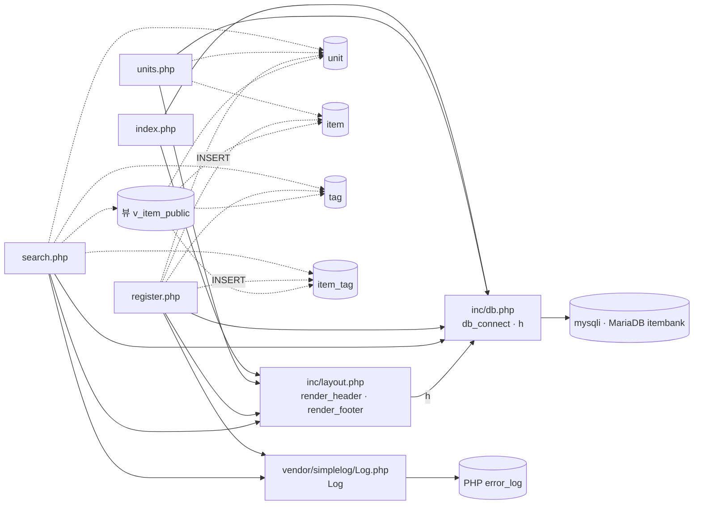

# item-bank-php 아키텍처

대상: `legacy/item-bank-php` (분석 범위: 진입점 · 의존 관계). 근거는 `파일:줄번호` 로 적고, 경로가 없는 파일명은 `legacy/item-bank-php/` 기준이다.

## 1. 모듈 개요

- 문항 검색 · 등록 · 단원 목록 화면을 제공하는 PHP 7.4 + Apache 앱이다(`Dockerfile:1`). DB 접근은 `mysqli` 를 쓴다(`Dockerfile:3`, `inc/db.php:21`).
- 파일 8개, 1,120줄이다. 이 중 `search.php` 가 731줄이다.
- 라우터가 없어 URL 이 곧 파일명이다. 화면 파일마다 공통 파일(`inc/db.php`, `inc/layout.php`)을 include 한다.
- compose 서비스 `item-bank`(profile `php`)로 띄우며, 호스트 포트는 8081 이다(`docker-compose.yml:35-39`).
- 검색 화면은 테이블이 아니라 뷰 `v_item_public` 을 조회한다(`search.php:522`).

## 2. 폴더 구조

```
legacy/item-bank-php/
├── Dockerfile               16줄  PHP 7.4-apache, mysqli, display_errors=Off, 오류 로그는 stderr
├── index.php                14줄  홈 메뉴
├── search.php              731줄  문항 검색 (함수 4개 + 최상위 실행부)
├── register.php            177줄  문항 등록 (함수 없음, 최상위 코드만)
├── units.php                48줄  단원 목록
├── inc/
│   ├── db.php               37줄  db_connect(), h()
│   └── layout.php           43줄  render_header(), render_footer()
└── vendor/simplelog/
    └── Log.php              54줄  외부 라이브러리(더미). error_log 로만 기록
```

## 3. 진입점

| URL / 화면 | 처음 실행되는 파일 | 그 파일이 부르는 주요 함수 |
|---|---|---|
| `/index.php` 홈 메뉴 | `index.php` | `render_header('홈')` (`index.php:5`), `render_footer()` (`index.php:14`). DB 조회 없음 |
| `/search.php` 문항 검색. GET `q, unit, level, tag, sort, dir, page` (`search.php:5-12`) | `search.php` | `render_header` (`search.php:709`) → `db_connect` (713) → `buildSearchQuery($_GET, $conn)` (722) → `renderSearchForm` (723) → `runSearchQuery` (724) → `renderResultTable` (725) → `render_footer` (731). 실패하면 `Log::error` (727) |
| `/register.php` 문항 등록. GET 은 폼, POST 는 저장 (`register.php:40`) | `register.php` | `db_connect` (`register.php:17`). POST 이면 검증(47-81) 후 `begin_transaction` (85), `commit` (114), `rollback` (120), `Log::info` (115), `Log::error` (121). 이어서 `render_header` (127), `render_footer` (177) |
| `/units.php` 단원 목록 | `units.php` | `render_header` (`units.php:5`) → `db_connect` (8) → `$conn->query` (20) → `h()` (40-43) → `render_footer` (48) |
| `/` | 미확인 | 7절 참고 |

## 4. 의존 관계

### 4.1 흐름도

화살표 `A --> B` 는 A 가 B 를 포함하거나 호출한다는 뜻이다. 실선은 include 와 함수 호출, 점선은 SQL 조회 · 쓰기다.



### 4.2 호출 표

| A → B | 종류 | 근거 |
|---|---|---|
| `index.php` → `inc/db.php`, `inc/layout.php` | include | `index.php:2-3` |
| `units.php` → `inc/db.php`, `inc/layout.php` | include | `units.php:2-3` |
| `register.php` → `inc/db.php`, `inc/layout.php`, `vendor/simplelog/Log.php` | include | `register.php:2-4` |
| `search.php` → `inc/db.php`, `inc/layout.php`, `vendor/simplelog/Log.php` | include | `search.php:20-22` |
| `index.php` · `inc/layout.php` → `search.php`, `register.php`, `units.php` | 링크 (include 아님) | `index.php:9-11`, `inc/layout.php:10-12` |
| `inc/layout.php` `render_header` → `inc/db.php` `h()` | 함수 호출 | `inc/layout.php:17, 33` |
| `search.php` `buildSearchQuery` → `Log::debug`, `Log::error` | 함수 호출 | `search.php:103, 528, 537` |
| `search.php` `buildSearchQuery` → `h()` | 함수 호출 | `search.php:360` 이하 다수 |
| `search.php` `renderResultTable` → `h()` | 함수 호출 | `search.php:674-678, 690-700` |
| `Log::write` → PHP `error_log` | 함수 호출 | `vendor/simplelog/Log.php:52` |
| `inc/db.php` `db_connect` → `mysqli` | 연결 생성 | `inc/db.php:21` |
| `search.php` → 뷰 `v_item_public` | SQL 조회 | `search.php:522`, `search.php:244-245` |
| `search.php` → `unit` | SQL 조회 | `search.php:125, 156` |
| `search.php` → `tag` | SQL 조회 | `search.php:178` |
| `search.php` → `item_tag`, `tag` | SQL 조회 (EXISTS) | `search.php:244` |
| `units.php` → `unit`, `item` | SQL 조회 | `units.php:16-19` |
| `register.php` → `unit`, `tag` | SQL 조회 | `register.php:27, 34` |
| `register.php` → `item` | `MAX(id)+1 … FOR UPDATE`, `INSERT` | `register.php:87, 93` |
| `register.php` → `item_tag` | `INSERT` | `register.php:105` |
| 뷰 `v_item_public` → `item`, `unit`, `item_tag`, `tag` | 뷰 정의 | `db/mariadb/init/01-schema.sql:52-70` |

### 4.3 의존 관계에서 주의할 점

- **숨은 include 순서.** `inc/layout.php` 는 `h()` 를 호출하지만 `inc/db.php` 를 include 하지 않는다. 그래서 화면 파일이 `db.php` 를 먼저 include 해야 동작한다(`inc/layout.php:17, 33`).
- **DB 연결 재사용.** `db_connect` 는 `static` 변수로 요청 하나 안에서 연결을 재사용한다(`inc/db.php:9-12`).
- **접속 정보.** 환경 변수를 쓰고, 없으면 기본값을 쓴다(`inc/db.php:14-18`). compose 가 넣어 주는 값과 같다(`docker-compose.yml:40-45`).
- **공개 기준이 두 곳에 있다.** 검색은 뷰의 `WHERE i.status = 'A'`(`db/mariadb/init/01-schema.sql:70`)를 거치고, 단원 목록은 `status = 'A'` 를 SQL 에 직접 쓴다(`units.php:17`).
- **로그 출력.** `Log` 는 화면에 출력하지 않고 `error_log` 로만 기록한다(`vendor/simplelog/Log.php:4, 52`).

## 5. 가장 긴 함수 3개

모듈 전체의 함수는 9개다. 줄 수는 시작 줄과 끝 줄을 포함해 셌다.

| 순위 | 파일 · 함수 | 시작–끝 | 줄 수 | 하는 일 |
|---|---|---|---|---|
| 1 | `search.php` · `buildSearchQuery` | 42–564 | 523 | GET 파라미터로 WHERE · 정렬 · 페이지 SQL 을 조립하고, 폼 · 경고 · 요약 · 정렬 링크 HTML 까지 만들어 반환 |
| 2 | `search.php` · `renderResultTable` | 647–704 | 58 | 경고 · 요약 · 건수 · 결과 표 · 페이지 링크를 출력 |
| 3 | `search.php` · `runSearchQuery` | 571–624 | 54 | 건수 SQL 과 목록 SQL 을 `prepare` + `bind_param` 으로 실행해 `total`, `rows` 를 반환 |

- 4위는 `inc/layout.php` · `render_header` 로 7–36행, 30줄이다.
- `register.php` 는 함수 선언이 없어 순위에 들지 않는다. 하지만 최상위 코드 177줄이 사실상 함수 하나 역할을 한다.

## 6. 분석 중 발견한 규칙 후보

비즈니스 규칙 분석(4단계)은 아직 하지 않았다. 아래는 의존 관계를 읽는 중에 눈에 띈 것만 적은 것이다.

- **난이도 5 누락 가능성.** `search.php:213-216` 의 주석은 "난이도가 비어 있으면 1~5 모두 포함"이라고 하지만, 실제 SQL 은 `AND level < 5` 다. 따라서 난이도를 비우고 검색하면 난이도 5 문항이 빠진다. 교차 검증 때 실행해 확인했다(뷰 26건 중 조건 없는 검색 20건, [BUSINESS-RULES.md](BUSINESS-RULES.md) BR-11). 의도된 규칙인지는 확인이 필요하다.

## 7. 미확인

- 실제 실행 동작. 이 문서를 쓸 때는 요청을 보내지 않았다. 이후 비즈니스 규칙 교차 검증에서 `search.php` 에 GET 요청만 보내 일부 동작을 확인했다([BUSINESS-RULES.md](BUSINESS-RULES.md) 11절). `register.php` POST 와 `units.php` 는 실행하지 않았다.
- `/` 요청이 어떤 파일로 연결되는지. Apache `DirectoryIndex` 설정이 저장소 안에 없다.
- DB 에 실제로 들어 있는 시드 데이터.
- 6절의 `level < 5` 가 의도된 규칙인지 버그인지.
