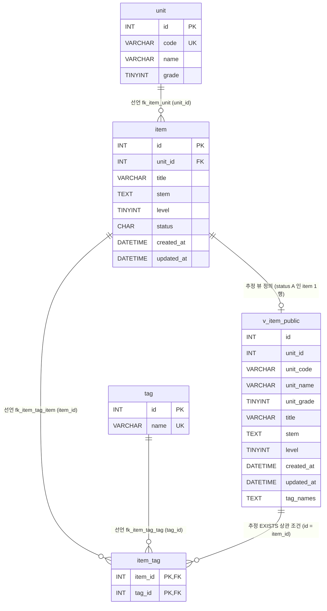

# item-bank-php 데이터 흐름 · ERD

대상: `legacy/item-bank-php`. 모듈 구조와 진입점은 [ARCHITECTURE.md](ARCHITECTURE.md) 를 따른다. 근거는 `파일:줄번호` 로 적고, 경로가 없는 파일명은 `legacy/item-bank-php/` 기준이다. 스키마는 `db/mariadb/init/01-schema.sql`(아래 `01-schema.sql`)이다.

분석 방법: 스키마 파일의 `CREATE TABLE` · `CREATE VIEW` 와 모듈 PHP 파일의 SQL 문자열(`query` · `prepare`)을 읽었다. 모듈 전체에서 `UPDATE` · `DELETE` 문은 없다(`grep` 결과 0건). 최초 작성 때는 실제 DB 에 접속하지 않았고, 이후 교차 검증 때 뷰 조회 몇 건만 실행했다(4절).

## 1. 테이블 목록

모듈이 접근하는 테이블 4개와 뷰 1개다.

| 테이블 | 주요 컬럼 | 키 · 제약 | 근거 |
|---|---|---|---|
| `unit` 단원 | `id` INT, `code` VARCHAR(16), `name` VARCHAR(100), `grade` TINYINT | PK `id`, UNIQUE `code` | `01-schema.sql:11-18` |
| `item` 문항 | `id` INT, `unit_id` INT, `title` VARCHAR(200), `stem` TEXT, `level` TINYINT(1~5, 주석), `status` CHAR(1) 기본 `'A'`(A=공개 D=삭제 R=검수중, 주석), `created_at` · `updated_at` DATETIME | PK `id`(AUTO_INCREMENT 아님), FK `unit_id → unit.id`, 인덱스 `unit_id` · `level` | `01-schema.sql:20-33` |
| `tag` 태그 | `id` INT, `name` VARCHAR(50) | PK `id`, UNIQUE `name` | `01-schema.sql:35-40` |
| `item_tag` 문항-태그 연결 | `item_id` INT, `tag_id` INT | PK (`item_id`, `tag_id`), FK `item_id → item.id`, FK `tag_id → tag.id` | `01-schema.sql:42-48` |
| `v_item_public` (뷰) | `id`, `unit_id`, `unit_code`, `unit_name`, `unit_grade`, `title`, `stem`, `level`, `created_at`, `updated_at`, `tag_names`(태그 이름을 `,` 로 이은 문자열) | `item JOIN unit`, `WHERE i.status = 'A'` | `01-schema.sql:52-70` |

- `level` 의 1~5 범위와 `status` 코드의 의미는 스키마 주석에만 있고 `CHECK` 제약은 없다(`01-schema.sql:25-26`). 등록 화면은 코드로 1~5 를 검증한다(`register.php:70`).
- 네 테이블 모두 `COLLATE=utf8mb4_unicode_ci`(대소문자 무시)다(`01-schema.sql:18, 33, 40, 48`). 그래서 검색의 `unit_code = ?` 는 `m5-1` 과 `M5-1` 을 같게 본다. 비즈니스 규칙 교차 검증 때 실행 중인 DB 에서 확인했다([BUSINESS-RULES.md](BUSINESS-RULES.md) BR-09).
- 같은 스키마 파일에 `class` · `assignment` · `distribution` · `submission` 테이블도 있지만(`01-schema.sql:75-115`) 이 모듈은 접근하지 않는다. 그중 `assignment.unit_id → unit.id` 는 이 모듈의 `unit` 을 참조한다(`01-schema.sql:89`).

## 2. 테이블 관계

- **선언**: 스키마에 `FOREIGN KEY` 로 선언된 관계.
- **추정**: 외래 키는 없고 코드의 JOIN · 상관 조건에서 추정한 관계.

| 관계 | 구분 | 근거 (선언) | 코드에서 쓰는 곳 |
|---|---|---|---|
| `unit` 1 : N `item` | 선언 | `01-schema.sql:32` | 뷰 `JOIN unit u ON u.id = i.unit_id`(`01-schema.sql:69`), 단원별 문항 수 상관 서브쿼리 `i.unit_id = u.id`(`units.php:17`) |
| `item` 1 : N `item_tag` | 선언 | `01-schema.sql:46` | 뷰 `WHERE it.item_id = i.id`(`01-schema.sql:67`), 등록 시 INSERT(`register.php:105`) |
| `tag` 1 : N `item_tag` | 선언 | `01-schema.sql:47` | 뷰 `JOIN tag t ON t.id = it.tag_id`(`01-schema.sql:66`), 태그 검색 `JOIN tag t ON t.id = it.tag_id`(`search.php:244`) |
| `item` → `v_item_public` | 추정 | 없음 (뷰 정의) | `status = 'A'` 인 `item` 한 행이 뷰 한 행이 된다(`01-schema.sql:68-70`) |
| `v_item_public` 1 : N `item_tag` | 추정 | 없음 | `it.item_id = v_item_public.id`(`search.php:245`). 뷰의 `id` 가 `item.id` 이므로 결국 `item` 1 : N `item_tag` 와 같은 관계다 |

- 코드의 JOIN 중 선언된 외래 키와 어긋나는 것은 찾지 못했다. 추정 관계 2개는 모두 뷰를 거친 것이다.
- `item.unit_id` 는 NOT NULL 이라 문항은 반드시 단원 하나에 속한다(`01-schema.sql:22`).

## 3. 읽기 · 쓰기 위치

`register.php` 와 `units.php` 는 함수 선언이 없어 "최상위 코드"로 적는다.

### 3.1 `unit`

| 구분 | 파일 · 함수 | SQL · 용도 | 근거 |
|---|---|---|---|
| 읽기 | `search.php` · `buildSearchQuery` | `SELECT name, grade FROM unit WHERE code = ?` — 검색 요약에 단원 이름 표시, 없는 코드면 경고 | `search.php:125` |
| 읽기 | `search.php` · `buildSearchQuery` | `SELECT code, name, grade FROM unit ORDER BY grade, code` — 검색 폼 단원 선택 목록 | `search.php:156` |
| 읽기 | `units.php` · 최상위 코드 | `SELECT u.id, u.code, u.name, u.grade, (…) FROM unit u ORDER BY u.grade, u.code` — 단원 목록 | `units.php:16-19` |
| 읽기 | `register.php` · 최상위 코드 | `SELECT id, code, name FROM unit ORDER BY grade, code` — 등록 폼 선택 목록 · 단원 검증 | `register.php:27` |
| 읽기 (간접) | `search.php` · `runSearchQuery` | 뷰 `v_item_public` 이 `unit` 을 JOIN | `search.php:577, 600`, `01-schema.sql:69` |
| 쓰기 | 없음 | — | — |

### 3.2 `item`

| 구분 | 파일 · 함수 | SQL · 용도 | 근거 |
|---|---|---|---|
| 읽기 | `units.php` · 최상위 코드 | `SELECT COUNT(*) FROM item i WHERE i.unit_id = u.id AND i.status = 'A'` — 단원별 공개 문항 수 | `units.php:17` |
| 읽기 (잠금) | `register.php` · 최상위 코드 | `SELECT COALESCE(MAX(id), 0) + 1 AS next_id FROM item FOR UPDATE` — 다음 id 계산(트랜잭션 안) | `register.php:87` |
| 읽기 (간접) | `search.php` · `runSearchQuery` | 뷰 `v_item_public` 이 `item` 을 조회 | `search.php:577, 600`, `01-schema.sql:68` |
| 쓰기 INSERT | `register.php` · 최상위 코드 | `INSERT INTO item (id, unit_id, title, stem, level, status, created_at, updated_at) VALUES (?, ?, ?, ?, ?, 'R', NOW(), NOW())` | `register.php:92-95` |
| 쓰기 UPDATE · DELETE | 없음 | — | — |

### 3.3 `tag`

| 구분 | 파일 · 함수 | SQL · 용도 | 근거 |
|---|---|---|---|
| 읽기 | `search.php` · `buildSearchQuery` | `SELECT name FROM tag ORDER BY id` — 검색 폼 태그 선택 목록 · 등록된 태그인지 확인 | `search.php:178`, `search.php:251-260` |
| 읽기 | `search.php` · `buildSearchQuery` 가 조립 → `runSearchQuery` 가 실행 | 태그 조건 `EXISTS (… JOIN tag t … AND t.name = ?)` | `search.php:244-245`, `search.php:577, 600` |
| 읽기 | `register.php` · 최상위 코드 | `SELECT id, name FROM tag ORDER BY id` — 등록 폼 체크박스 · 태그 id 검증 | `register.php:34`, `register.php:74-81` |
| 읽기 (간접) | `search.php` · `runSearchQuery` | 뷰의 `tag_names` 서브쿼리 | `01-schema.sql:64-67` |
| 쓰기 | 없음 | — | — |

### 3.4 `item_tag`

| 구분 | 파일 · 함수 | SQL · 용도 | 근거 |
|---|---|---|---|
| 읽기 | `search.php` · `buildSearchQuery` 가 조립 → `runSearchQuery` 가 실행 | `EXISTS (SELECT 1 FROM item_tag it JOIN tag t … WHERE it.item_id = v_item_public.id AND t.name = ?)` | `search.php:244-245`, `search.php:577, 600` |
| 읽기 (간접) | `search.php` · `runSearchQuery` | 뷰의 `tag_names` 서브쿼리 | `01-schema.sql:64-67` |
| 쓰기 INSERT | `register.php` · 최상위 코드 | `INSERT INTO item_tag (item_id, tag_id) VALUES (?, ?)` — 검증된 태그 id 마다 1행 | `register.php:105-111` |
| 쓰기 UPDATE · DELETE | 없음 | — | — |

### 3.5 뷰 `v_item_public`

| 구분 | 파일 · 함수 | SQL · 용도 | 근거 |
|---|---|---|---|
| 읽기 (SQL 조립) | `search.php` · `buildSearchQuery` | `SELECT id, title, unit_code, level, tag_names, created_at FROM v_item_public WHERE … ORDER BY … LIMIT 20 OFFSET ?` 와 `SELECT COUNT(*) AS cnt FROM v_item_public WHERE …` | `search.php:521-526` |
| 읽기 (실행) | `search.php` · `runSearchQuery` | 건수 SQL → 목록 SQL 순서로 `prepare` · `bind_param` · `execute` | `search.php:577, 600` |
| 쓰기 | 없음 (뷰) | — | — |

검색 조건 · 정렬에 쓰는 뷰 컬럼:

| 컬럼 | 용도 | 근거 |
|---|---|---|
| `title`, `stem` | 키워드 `LIKE ?` | `search.php:98` |
| `unit_code` | 단원 코드 일치 | `search.php:118` |
| `level` | 난이도 일치, 빈 값이면 `level < 5` | `search.php:215-226` |
| `id` | 태그 EXISTS 상관 조건 | `search.php:245` |
| `id`, `title`, `unit_code`, `level`, `created_at` | `ORDER BY` | `search.php:279-325` |

### 3.6 데이터 흐름 요약

- **쓰기 경로는 `register.php` 하나뿐이다.** 트랜잭션(`register.php:85`) 안에서 `item` 의 `MAX(id)+1` 을 `FOR UPDATE` 로 구해(87) `item` 1행(93)과 `item_tag` N행(105)을 넣고 커밋한다(114). 실패하면 롤백한다(120).
- **등록한 문항은 검색 · 단원 목록에 바로 나오지 않는다.** 등록은 `status = 'R'` 로 넣고(`register.php:94`), 검색은 `status = 'A'` 만 보이는 뷰를 쓰며(`01-schema.sql:70`), 단원 목록도 `status = 'A'` 만 센다(`units.php:17`).
- **읽기만 하는 컬럼 · 쓰기만 하는 컬럼.** `item.updated_at` 은 INSERT 때 채우지만(`register.php:94`) 모듈 어디에서도 읽지 않는다. 뷰의 `unit_id` · `unit_name` · `unit_grade` · `updated_at` 도 검색 SQL 이 선택하지 않는다(`search.php:521`).
- **스키마 주석과 코드가 다르다.** 뷰 주석은 "검색 화면과 등록 화면이 모두 이 뷰를 기준으로 삼는다"(`01-schema.sql:51`)고 하지만, `register.php` 는 뷰를 읽지 않고 `unit` · `tag` · `item` · `item_tag` 를 직접 다룬다.

## 4. 미확인

- **`status` 를 `R` → `A` 로 바꾸는 경로.** 이 모듈에는 `UPDATE` 문이 없다. 검수 완료 처리가 다른 모듈 · 수작업 SQL 중 어디서 일어나는지 확인하지 않았다.
- **`status = 'D'`(삭제)를 쓰는 경로.** 이 모듈에는 없다. 삭제가 어떻게 일어나는지 미확인.
- **`tag` · `unit` 을 추가 · 수정하는 경로.** 이 모듈은 두 테이블을 읽기만 한다. 시드(`db/mariadb/init/02-seed.sql`) 외의 쓰기 경로는 미확인.
- **실행 중인 DB 의 스키마가 `01-schema.sql` 과 같은지.** 전체는 비교하지 않았다. 교차 검증 때 `v_item_public` 조회(난이도별 건수, `unit_code` 대소문자 비교)만 해 보았고 결과는 스키마 파일과 어긋나지 않았다.
- **`level` · `status` 에 스키마 주석 밖의 값이 실제로 들어 있는지.** `CHECK` 제약이 없어 DB 데이터를 봐야 알 수 있다.
- **다른 모듈(`legacy/assignment-thymeleaf`, `modern/api`)이 `item` · `item_tag` 를 쓰는지.** 이번 분석 범위 밖이다.
